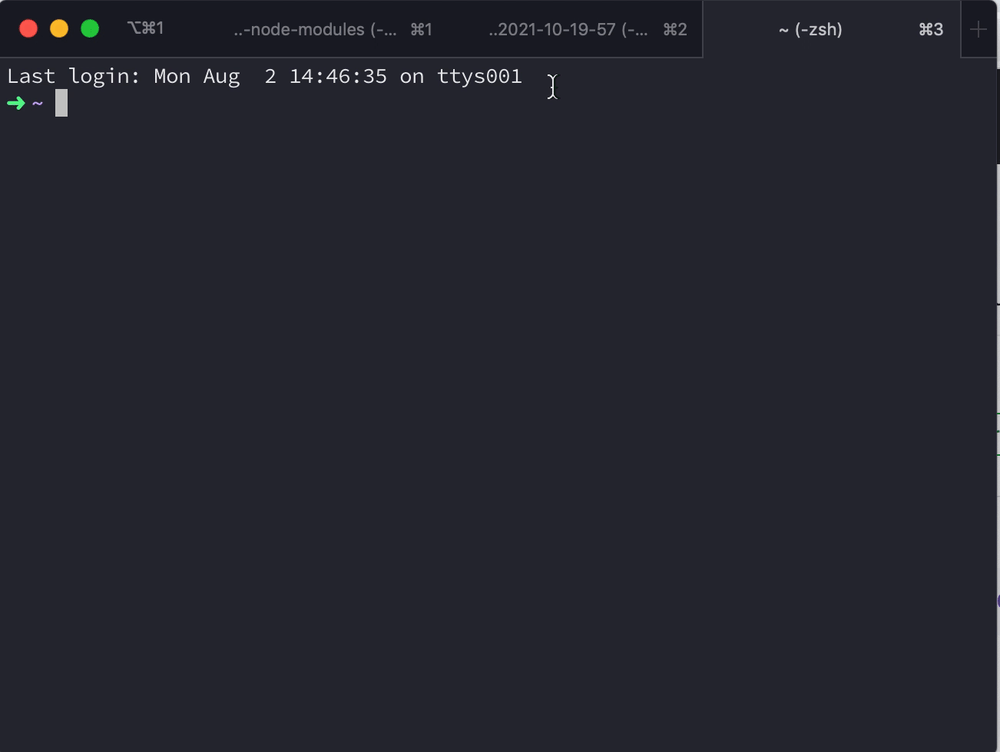

# remove-node-modules

För att enkelt ta bort alla node_modules i flera projekt i en mapp. Mata in absolut sökväg och skriptet kommer söka igenom efter node_modules-mappen i den mappen och alla under mappar rekursivt och ta bort dessa.

## Installation

```
npm install -g @zocom-christoffer-wallenberg/remove-node-modules@1.0.0
```

## Instruktioner

